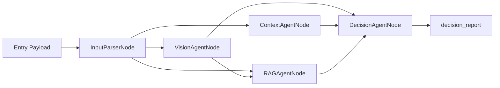

# VERITAS

Sistema multi-agente per supporto decisionale in viticoltura, con:

- classificazione malattie fogliari da immagine (CNN PyTorch Lightning)
- arricchimento contesto meteo (Open-Meteo)
- retrieval semantico su linee guida e prodotti fitosanitari (Qdrant + embedding OpenVINO)
- decisione finale assistita da LLM (MASFactory)

## 1) Obiettivo del progetto

VERITAS riceve dati di vigneto (localita, fase fenologica, storico trattamenti, immagine foglia) e produce un report decisionale tecnico che integra:

- ipotesi diagnostica visiva e confidenza
- contesto meteo locale
- evidenze da documenti tecnici e base prodotti
- raccomandazione prudente, motivata e tracciabile

Il sistema e pensato come **supporto** al tecnico/agronomo, non come prescrizione definitiva.

## 2) Architettura logica

Il grafo e definito in `architecture/masfactory_graph.py` e usa 5 nodi:

1. `InputParserNode`: riceve payload e lo smista.
2. `VisionAgentNode`: classificazione immagine foglia (`tools/cnn_leaf_disease_tool.py`).
3. `ContextAgentNode`: contesto agronomico + tool meteo (`tools/weather_tool.py`).
4. `RAGAgentNode`: retrieval semantico via Qdrant (`tools/rag_retrieval_tool.py`).
5. `DecisionAgentNode`: sintesi finale multi-sorgente.



## 3) Struttura repository (reale, sintetica)

```text
VERITAS/
|- main.py
|- config/
|  `- settings.py
|- architecture/
|  `- masfactory_graph.py
|- agents/
|  |- InputParser.py
|  |- VisionAgent.py
|  |- ContextAgent.py
|  |- RAGAgent.py
|  `- DecisionAgent.py
|- tools/
|  |- cnn_leaf_disease_tool.py
|  |- weather_tool.py
|  |- embedding_tool.py
|  |- qdrant_client_factory.py
|  `- rag_retrieval_tool.py
|- scripts/
|  |- export_embedding_openvino.py
|  |- chunk_markdown_documents.py
|  |- chunk_products_json.py
|  |- build_qdrant_index.py
|  |- test_rag_search.py
|  `- inline_html_tables.py
|- data/
|  |- guidelines/
|  `- products/
|- dataset/
|- models/
`- vector_store/
```

## 4) Stack tecnico

- Orchestrazione agenti: `masfactory`
- Vision: `torch`, `torchvision`, `pytorch-lightning`, `Pillow`
- Retrieval: `qdrant-client`, `sentence-transformers`, `tqdm`
- Embedding accelerato: `openvino`, `optimum-intel`, `nncf`
- Meteo: Open-Meteo API (geocoding + forecast)

## 5) Prerequisiti

- Windows + PowerShell (setup corrente del progetto)
- Python (launcher `py` disponibile)
- Connessione internet per:
  - chiamate LLM (`BASE_URL` configurato)
  - chiamate Open-Meteo
  - eventuale export embedding da Hugging Face

## 6) Installazione

1. Crea e attiva virtualenv (se non usi quella gia presente):

```powershell
py -3 -m venv .venv
.\.venv\Scripts\Activate.ps1
```

2. Installa dipendenze:

```powershell
pip install -r requirements.txt
```

3. Configura `.env` (chiavi rilevate nel progetto):

```env
OPENAI_API_KEY=...
BASE_URL=...
```

## 7) Configurazione principale (`config/settings.py`)

Parametri critici:

- CNN:
  - `MODEL_PATH`
  - `DATASET_DIR`
  - `IMAGE_SIZE`
  - `VISION_TOP_K`
- LLM:
  - `DEFAULT_LLM_MODEL` (usa `LegacyOpenAIModel`)
- RAG/Embedding:
  - `EMBEDDING_MODEL_LOCAL_PATH`
  - `EMBEDDING_MODEL_NAME`
  - `OPENVINO_DEVICE`
  - `QDRANT_LOCAL_PATH`
  - `QDRANT_COLLECTION_GUIDELINES`
  - `QDRANT_COLLECTION_PRODUCTS`

Nota: il progetto e configurato per usare prima il modello embedding OpenVINO locale.

## 8) Run end-to-end

Esecuzione di esempio:

```powershell
py -3 main.py
```

`main.py`:

1. inizializza la CNN una volta
2. costruisce il grafo MASFactory
3. invia payload demo (inclusa immagine foglia)
4. stampa il risultato finale (`decision_report`)

## 9) Pipeline dati e indicizzazione

Flusso consigliato:

1. Export embedding OpenVINO locale (one-shot)
2. Chunking linee guida Markdown
3. Chunking dataset prodotti JSON
4. Build indice Qdrant
5. Test retrieval

La guida operativa completa e in:

- [`scripts/README.md`](scripts/README.md)

## 10) Stato dati presenti in repository (snapshot attuale)

- Classi CNN train: `Black Rot`, `ESCA`, `Healthy`, `Leaf Blight`
- Split immagini:
  - train: 6318
  - val: 1353
  - test: 1356
- Chunks linee guida: 2192
- Chunks prodotti: 17622
- Collection Qdrant locali presenti:
  - `vine_guidelines`
  - `plant_protection_products`

## 11) Input e output attesi

Input minimo (entry payload):

```python
{
  "location": "...",
  "growth_stage": "...",
  "wine_type": "...",
  "recent_treatments": "...",
  "image": ImageAsset.from_path("...")
}
```

Output principale:

```python
{
  "decision_report": "..."
}
```

## 12) Troubleshooting rapido

- Errore modello embedding locale non trovato:
  - eseguire `py -3 scripts/export_embedding_openvino.py`
- Retrieval vuoto/non utile:
  - verificare che chunk JSONL esistano
  - ricostruire indice con `scripts/build_qdrant_index.py --recreate`
- Errori su API meteo:
  - controllare connettivita e localita passata al tool

## 13) File chiave da leggere per onboarding

- `main.py`
- `architecture/masfactory_graph.py`
- `agents/*.py`
- `tools/*.py`
- `config/settings.py`
- `scripts/README.md`
