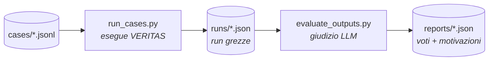

# Evaluation Harness

Sistema di valutazione **offline e qualitativo** per VERITAS. È esterno al grafo
MASFactory: non modifica il sistema, lo esegue su una batteria di casi e poi ne
giudica gli output con un LLM.

Il flusso ha due fasi indipendenti:



## File

| File | Ruolo |
|---|---|
| `recorder.py` | Cattura, via hook MASFactory, l'output strutturato di ogni nodo e lo serializza in JSON (niente parsing di log). |
| `run_cases.py` | Esegue VERITAS su ogni caso e salva una run JSON in `runs/`. |
| `prompt.py` | Rubrica e costruzione del prompt per l'evaluator (rubrica adattiva allo `state` dell'immagine). |
| `evaluate_outputs.py` | Legge le run, le fa giudicare all'LLM, salva un report in `reports/`. |
| `cases/example_cases.jsonl` | Definizione dei casi di test (un JSON per riga). **Versionata.** |
| `runs/` | Run grezze prodotte da `run_cases.py`. **Non versionata** (rigenerabile). |
| `reports/` | Report di valutazione prodotti da `evaluate_outputs.py`. **Non versionata** (rigenerabile). |

## Come si usa

Per l'esecuzione di `run_cases.py` è consigliato impostare `RAG_RELEASE_MODELS_AFTER_USE = False` in `config/settings.py` 

Dalla root del progetto (usa il Python del venv):

```powershell
# 1. Esegui VERITAS su tutti i casi
python evaluation/run_cases.py

# 2. Valuta le run prodotte
python evaluation/evaluate_outputs.py
```

Flag utili:

- `run_cases.py --only <id>` — esegue un solo caso.
- `evaluate_outputs.py --run <file.json>` — valuta una sola run.
- `evaluate_outputs.py --latest` — valuta solo l'ultimo batch.

## Formato dei casi (`cases/*.jsonl`)

Un oggetto JSON per riga:

```json
{"id": "case_01_black_rot", "description": "...", "image_path": "example_dataset/.../leaf.JPG", "location": "conegliano", "growth_stage": "fioritura", "wine_type": "prosecco", "recent_treatments": "nessun trattamento recente"}
```

`image_path` è relativo alla root del progetto. `id` è obbligatorio e dà il nome
ai file di run/report.

## Rubrica adattiva

La rubrica cambia in base allo `state` rilevato dal VisionAgent:

- **`valid image`** → rubrica agronomica completa (10 criteri: coerenza con la
  diagnosi, uso della confidenza, coerenza agronomica, uso del RAG, citazioni,
  sicurezza decisionale, completezza, non-allucinazione, chiarezza, utilità).
- **`invalid image` / `unusable image`** → rubrica di rifiuto (4 criteri: il
  sistema rifiuta correttamente, chiede una nuova foto, non allucina, è chiaro).

Ogni criterio è votato da 1 a 5. L'evaluator restituisce un JSON con i punteggi
per criterio, una motivazione, un `overall_score` e gli eventuali `red_flags`.

Per permettere la verifica delle citazioni, il prompt mostra al giudice le
**fonti recuperate** (`guidelines_hits`: documento, pagina, chunk, score), non
solo la sintesi in prosa del RAG: una citazione presente in quella lista non va
considerata inventata.

## Configurazione

In `config/settings.py`:

```python
EVALUATOR_LLM_MODEL_NAME = os.getenv("EVALUATOR_MODEL", "...")  # modello giudice
EVALUATOR_TEMPERATURE = 0.0
```

L'evaluator dovrebbe essere un modello più capace di quello giudicato. Si può
cambiare senza toccare il codice impostando la env var `EVALUATOR_MODEL`.
Condivide `OPENAI_API_KEY` / `BASE_URL` (OpenRouter) dal `.env`.

## Versionamento

Per mantenere la repo snella, su GitHub si versionano **gli script e `cases/`**,
ma **non** `runs/` né `reports/`: sono interamente rigenerabili eseguendo le due
fasi sui casi. Chiunque cloni la repo può quindi raggiungere lo stesso stato con:

```powershell
.venv/Scripts/python.exe evaluation/run_cases.py
.venv/Scripts/python.exe evaluation/evaluate_outputs.py
```

## Note

- Il grafo è costruito una sola volta e riusato tra i casi (evita di ricaricare
  i modelli pesanti del RAG). Un piccolo proxy in `run_cases.py` permette di
  associare un `EvaluationRecorder` diverso a ogni caso senza ricostruire il grafo.
- Una run che fallisce (immagine mancante, errore API) non blocca il batch:
  l'errore viene registrato nel JSON e l'esecuzione prosegue.
- Il traceback `QdrantClient.__del__ ... Python is likely shutting down` stampato
  a fine esecuzione è innocuo (garbage collection allo shutdown).
